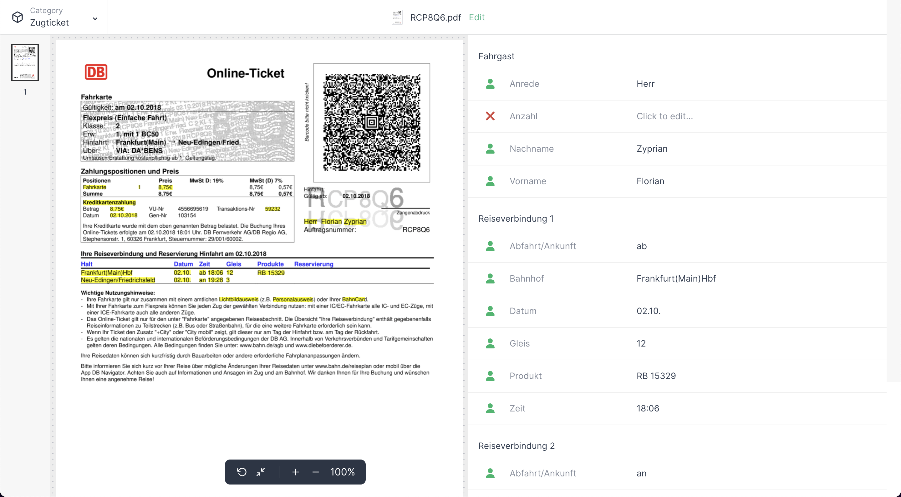
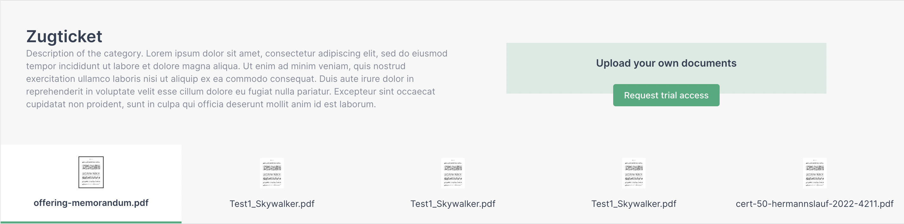
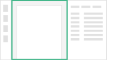
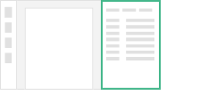

# konfuzio-capture-vue

(Under active development)

White Label widget, that let's you upload your documents to Konfuzio and preview the results. Chrome, Firefox, Edge and Safari supported.

# **Requirements**

Software Required:

- node
- npm

# **Installation**

Follow the steps below to get the app running.

1. Clone Repository
2. Run `npm install` in the project root.
3. Create a `.env` file in the project root with the properties from the `.env.example` file.
4. Run `npm run serve` to serve a local development app to run on a browser (default localhost:3000).
5. Optional: Run `npm run build` to build the app for production if you want to put it on a web server. After building, export the `dist` folder to the desired location.

# **Documentation**

This sample app is built around Vue.JS and all the required components are inside the `app` folder.

## Vue Components

The entry point of the app is the `main.js` where the `App.vue` component is loaded. This component has the responsibility to tell the store to fetch API data and save it. While fetching the data, the main UI of the app is drawn on the `DocumentsList` and `DocumentDashboard` components.

## DocumentsList

This main component is responsible of loading the documents list for a given category. You can then select which document will appear on the dashboard. By default, this feature is disabled and in order to use it, you will need to add an authentication token to the `.env` file alongside the category ID that you want to load.

## DocumentDashboard

This main component is divided into three components: `DocumentThumbnails`, `DocumentPage` and `DocumentAnnotations`.

### DocumentThumbnails

This is a simple component to just load the document images and display them in a vertical list to act as a thumbnail selector. Is fully clickable and updates it state automatically.

### DocumentPage

This component is responsible for drawing the document and handling any interaction with it like scrolling (`ScrollingDocument.vue`) and render a loading dummy page (`DummyPage.vue`). It also draws the bounding boxes for the existing annotations.

### DocumentAnnotations

This component is responsible for creating a tab bar container to interact with each label set on the project. For each label set selected, a list of labels and annotations are shown alongside with their information.

## Store

The store is implemented using `Vuex` and is located under `store/index.js`. Is responsible for the behaviour of the app, is where most of the information is obtained, filtered, grouped and processed.

## Styles

The styles for each component are located under the `style` tag in each component file. The app is configured with Buefy library so if you want to edit the app theme you can go to the file `assets/scss/variables.scss` and edit all the colors and variables to match the desired design. You can also add new ones following the guidelines from the Bulma documentation: https://bulma.io/documentation/overview/variables/.
Regarding the icons, the app is using FontAwesome so if you need to add any new icon, you can do it on the `main.js` file on the icon library.

# **Tests**

You can test the app by running `npm run test:unit`. Tests are developed using `Vue Test Utils` and are located on the `tests` folder. Mock data is used to get information into the testing environment and so there's no requirement to connect to an API. They are grouped by the four main components and are focused on testing the components behavior.
