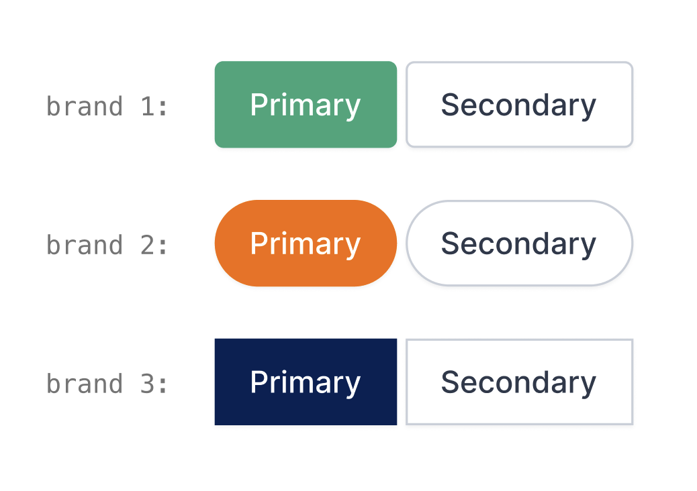

.. meta::
:description: this section explains the different user and mode options available in the Document Validation UI

# Explanations

## Managing users in the Konfuzio Document Validation UI

There are two options to manage users in the Document Validation UI:

- The first option is to [create a single user](https://app.konfuzio.com/accounts/signup/) with limited permissions (i.e. with the [Reader role](https://help.konfuzio.com/modules/superuserroles/index.html)) and [user token](https://app.konfuzio.com/v3/swagger/#/auth/auth_create), that anyone who interacts with the user interface can use in a Project. Since the token will be public, this option is best suited for a read-only view.
- The second one is to create as many users as needed, each with its token. This is best suited for Projects that use [single sign-on authentication](https://dev.konfuzio.com/web/api-v3.html#single-sign-on-sso-authentication) and/or where users will be interacting with the Documents (annotating and revising) since it allows for fine-grained control over who can access what, and it allows the application to keep a record of the different actions performed by them.

## Read Only Mode vs. Full Mode

The Konfuzio Document Validation UI can be configured to be run as Read Only or Full Mode:

### Read Only Mode

This is the default mode of the app. In this mode, you will have a sample Document with Annotations that you can only preview. Unless configured, it uses the default API endpoint at https://app.konfuzio.com and no user account is needed.

### Full Mode

If you want to run the widget in full mode to be able to interact with the Document by editing Annotations, Document Pages, and other functionalities, you will need to have a user account created (more information in our [Managing users](/dvui/explanations.html#managing-users-in-the-konfuzio-document-validation-ui) section). Then, you should generate a user token by accessing the [Konfuzio API version 3 Auth Request](https://app.konfuzio.com/v3/swagger/) and making a request with your username and password. If the provided credentials are correct, then a Token will be generated that you can copy and add to the `.env` file (see below for more details).

You will also need a [Document uploaded](https://app.konfuzio.com/v3/swagger/#/documents/documents_create) and a Document id, and will need to be logged in to [Konfuzio](https://app.konfuzio.com/)) before being able to upload the Document. After successfully uploading it, if you want to show it on the Document Validation UI, you can copy the Document id from the URL, as shown in the image below:

.. image:: ./images/docid.png

#### Environment variables

To complete the setup, create an environment variables file `.env` on the root of the repository based on the [.env.example](https://github.com/konfuzio-ai/document-validation-ui/blob/main/.env.example). You can also add the same variables as parameters to the application in the `HTML`, see the
Any variable defined in the `.env` will have priority from the ones defined in the [HTML](https://github.com/konfuzio-ai/document-validation-ui/blob/main/public/index.html).

Required variables:

- document: Document ID to load, is possible to also set the Document ID through the URL query parameters like `?document=ID`.

Optional variables:

- user_token: User token for API authenticated requests.
- api_url: The API URL, will be `https://app.konfuzio.com/api/v3` if left empty.
- image_url: The files URL, will be `https://app.konfuzio.com` if left empty.
- locale: The language of the application, the default will be `en` if left empty.
- full_mode: If no User token is set, you can force full mode by setting this variable to true.
- sentry_dsn: Sentry [DSN](https://docs.sentry.io/product/sentry-basics/dsn-explainer/?original_referrer=https%3A%2F%2Fwww.google.com%2F)
- sentry_environment: Sentry [environment](https://docs.sentry.io/product/sentry-basics/environments/?original_referrer=https%3A%2F%2Fwww.google.com%2F)
- documents_list_path: The path to a list of Documents in the application. This variable will be used to redirect the user to the specified list of Documents in the application so that they can continue with the review process of other Documents after certain changes like [splitting](https://help.konfuzio.com/document-validation-ui/review-documents/split/index.html), rotating or sorting. A `/` character should be added both at the start and end of the pathname.
- details_url: The path to the document details page where you can change other options not available on the app (for example, permissions) or see logs related to the document. If not set, the button will not appear.
- annotation: Annotation ID of the desired annotation that should be selected on the list.
- annotation_set: Annotation Set ID of the desired annotation set that should be selected on the list.

To define this variables in the `.env`, they should be in uppercase and with the prefix `VUE_APP_`.
Examples:

Defining in the `.env` file:

```
VUE_APP_LOCALE=
```

Defining in the `HTML` file:

```
<div id="app">
    <app locale="de/en/es"></app>
  </div>
```

## Multilingual User Interface

The Document Validation UI can currently be used in three languages: German (de), English (en), and Spanish (es). As mentioned in the previous section, you can specify what the default language of the application will be.

If left empty, then the default `en` will be used.

You are also welcome to create a new locales file for a language not currently provided by us, considering the data from [our existing files](https://github.com/konfuzio-ai/document-validation-ui/tree/main/src/locales), and share it with us via a [Support Ticket](https://konfuzio.com/en/support/) or create a Pull Request to add it to the repository.

## How to integrate the Document Validation UI into custom solutions?

The application requires `node` and `npm` to run. It also requires a connection to the [Konfuzio Server API version 3](https://app.konfuzio.com/v3/swagger/). See [full documentation](https://dev.konfuzio.com/web/api-v3.html).

There are a few different options to integrate the Document Validation UI into your Project, which can be read about in more detail in our tutorial section [here](https://dev.konfuzio.com/dvui/tutorials.html).

### Run the Document Validation UI in non-Vue applications

If your application is developed using technologies other than Vue (for example React or Angular), you can build the Document Validation UI application into a package, as described in our [configuration example](#configure-the-application), and import it to your existing project, or install it as an npm package.

#### Run in React

You can find a full example of using the Document Validation UI in a React application [here](https://medium.com/@pateldhruv020/using-vue-component-in-react-9161f30d29a0).

#### Run in Angular

At [this link](https://www.ais.com/using-a-vue-component-in-an-angular-app/) you will see a step-by-step on how to use the Document Validation UI in an Angular application.

## How to customize the Document Validation UI?

With our software, you can change the primary color of the user interface to match your brand. This allows you to create a seamless experience for your users and reinforce your brand identity.
To change the primary color, simply add a `:root` pseudo-class to your `CSS` file or inside a `<style>` tag in your `index.html`, inside which you can set the variable `--primary-color` to your custom hue to match your exact brand color (see an example [here](#how-to-add-the-custom-variables-to-your-project)).
Once you’ve selected your desired color, the user interface will update in real-time to reflect your changes. This means that you can easily experiment with different color options until you find the perfect match for your brand.

In addition to the primary color, you also have the ability to customize other aspects of the user interface, such as
the button border-radius. Whether your brand has sharp angles or soft curves, we allow you to make the perfect
adjustments to achieve the look and feel that you want. For this customization, all you have to do is set a second
variable `--primary-button` to the desired value.



### How to add the custom variables to your project?

Below are two examples of how to set the custom variables, whether in the `index.html` or in a dedicated `CSS` file.

_Please note that the default values from the examples below are based on Konfuzio's default styles._

.. \_custom-variables-html:

#### HTML

```

<div id="app">
   <app document="id" locale="de/en/es" user_token="token" documents_list_path="/document_list_path/"></app>
 </div>

<style>
  :root {
    --primary-color: #41AF85;
    --primary-button: 4px;
  }
</style>

```

.. \_custom-variables-css:

#### CSS file

```

:root {
--primary-color: #41AF85 !important;
--primary-button: 4px !important;
}

```

### Try it out before adding it to your project

If you want to test the final result before making changes to your application, you can do
so [here](https://codepen.io/konfuzio/pen/QWVpKVE).

_The example from Codepen shows the Read only mode of the Document Validation UI, which has limited functionalities. To
see all the features the UI has to offer, you can add
your [user token](https://app.konfuzio.com/v3/swagger/#/auth/auth_create) and change the Document ID in the `app` tag._

We hope this feature will help you take your branding to the next level and provide an even more engaging experience for
your users. If you have any questions or need assistance with customization, please don’t hesitate to
contact [support](https://konfuzio.com/en/support/).
