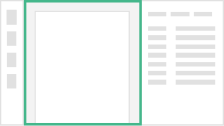

.. meta::
:description: overview of the Document Validation UI

.. \_Konfuzio Document Validation UI overview:

# What is the Konfuzio Document Validation UI?

The Konfuzio Document Validation UI is a collection of open-source components, developed with [Vue.js](https://v2.vuejs.org/), that lets you preview and interact with Documents uploaded to [Konfuzio Server](https://konfuzio.com/).

Chrome (from version 51), Firefox (from version 54), Edge (from version 15), and Safari (from version 10) are supported in the latest version.

If you want to read the full user guide visit [this link](https://help.konfuzio.com/document-validation-ui/index.html).

## Components

The app has three primary components, and four secondary ones:

### Primary Components

#### Document Thumbnails

This is a simple component that loads the Document images and displays them in a vertical list to act as a thumbnail selector. It is fully clickable and it updates its state automatically.

#### Document Page

This component is responsible for drawing the Document and handling any interaction with it. It uses [Konva JS](https://konvajs.org/docs/vue/index.html) to render a canvas element that has the Document image as background and shapes on top. Most of the shapes are Annotations from the Konfuzio API.

#### Document Annotations

This component creates a list to interact with each Annotation on the Document. You can accept, decline or edit the Annotation, edit empty Labels, and change the Annotation bounding box, among other things.

### Secondary Components

#### Document Edit

This component is responsible for the edit mode interface, where splitting, reordering and rotating take place.

The interface comprises two sections, each featuring a Document preview for enhanced usability.

In the first section, a dynamic grid showcases a collection of Document images that can be reordered, split, and rotated. Clicking on an image updates the corresponding page in the preview.

The second section accommodates one or multiple rows, depending on whether the Document is being split. Each row includes an input field to modify the file name and a dropdown menu to select a different Category, if applicable.

#### Document Top Bar

The Document Top Bar contains a dropdown menu to change the Category of the current Document, and it also shows the name of the Document, which can be edited.

It also handles important action buttons that allow the Document review to be finished, as well as changes made in the Document Edit component to be saved.

#### Document Modals

This smaller component is composed of modals that do not belong to one specific component but affect the interface as a whole.

#### Documents List

This component is not currently being used in the application. It displays a list of Documents at the top of the interface, over the Document Top Bar, that have been filtered by the currently authenticated user and that belong to the same Category of the current Document. Clicking a Document from the list will open it.
