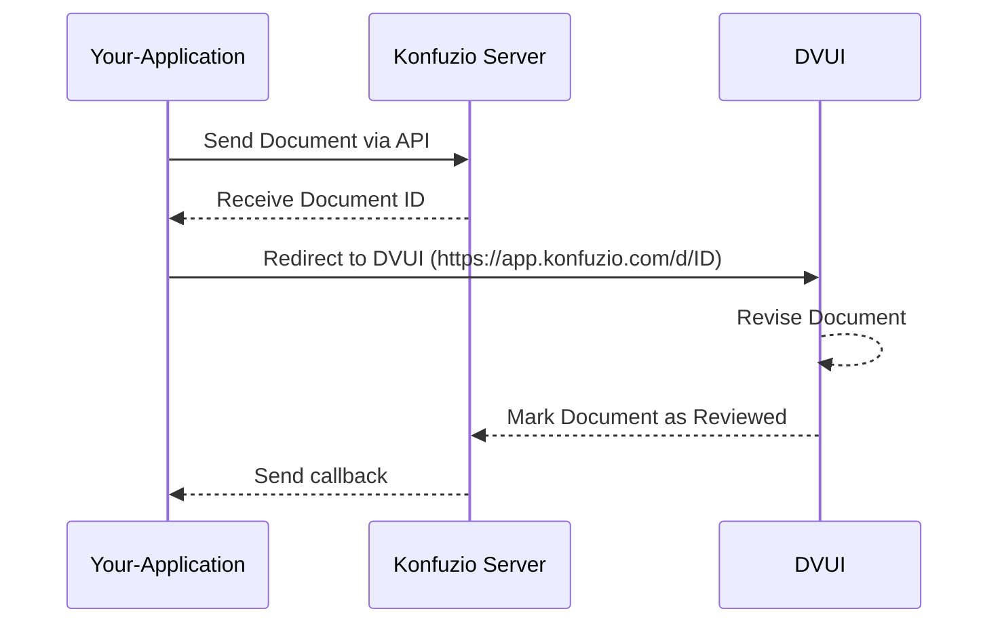
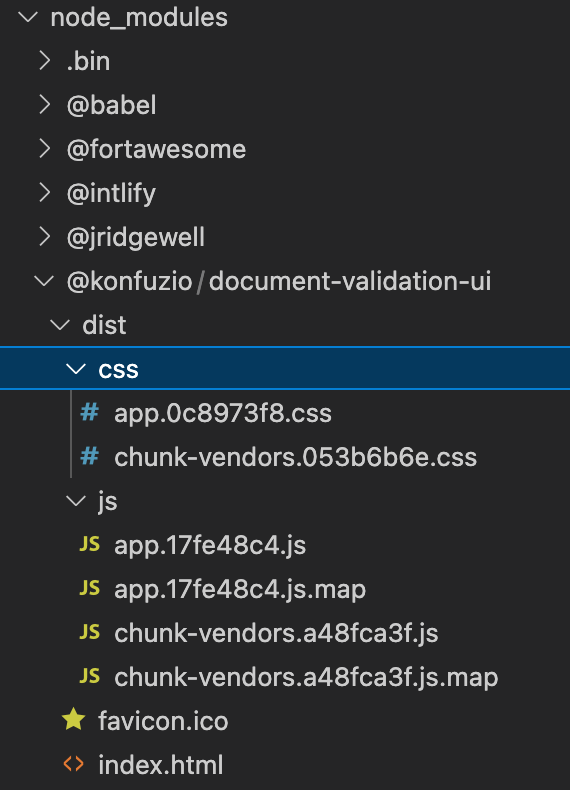
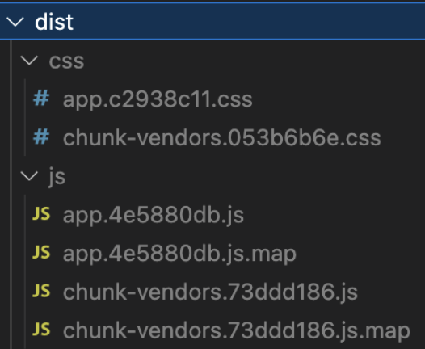
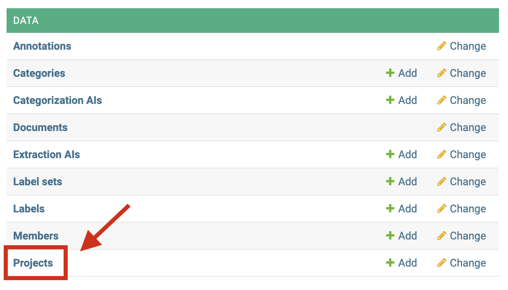
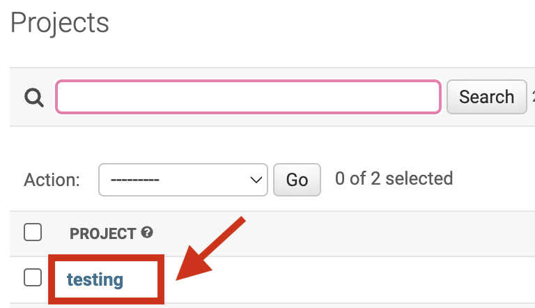
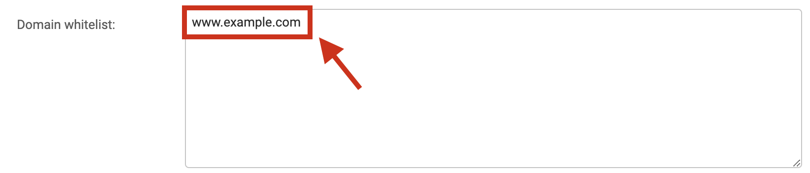
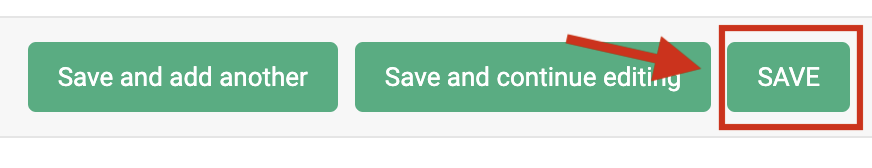
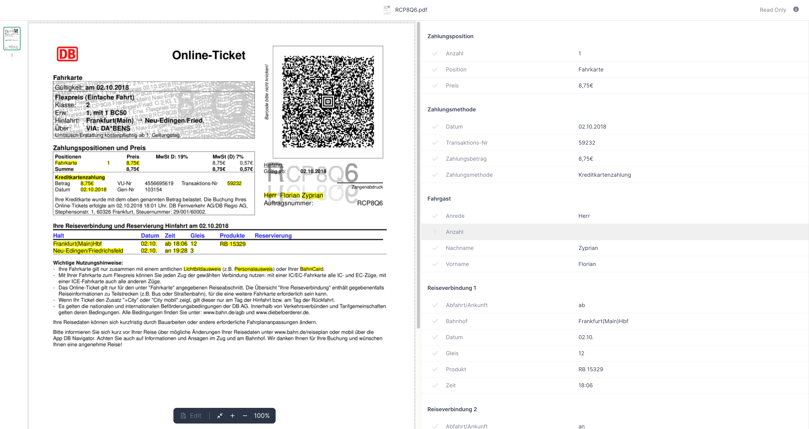

.. meta::
:description: this section contains tutorials for the Document Validation UI

# Integration Guide

Welcome to the guide for integrating the Konfuzio Document Validation UI (DVUI) into your application. To ensure a seamless and efficient integration process, we've outlined the most straightforward and effective method for incorporating DVUI, alongside alternative options tailored for specific scenarios.

## Prerequisites

- An active account on Konfuzio.
- Access to the Konfuzio Server API.

## Our Recommendation: CDN Integration

For most users and applications, we strongly recommend CDN integration. This method stands out for its simplicity, rapid deployment, and minimal maintenance, making it the optimal choice for a broad range of projects.

### Why Choose CDN Integration?

- **Ease of Use**: With just a few lines of HTML, your application can harness the full power of DVUI.
- **Quick Setup**: Integration can be completed in minutes, not hours.
- **Low Maintenance**: Updates and improvements are handled by Konfuzio, ensuring you always have access to the latest features without any additional effort.

### How to Integrate Using CDN

1. **Include DVUI from Our CDN**

   Add the following tags to your HTML to load DVUI's JavaScript and CSS:

   ```html
   <script defer="defer" src="https://unpkg.com/@konfuzio/document-validation-ui@latest/dist/js/chunk-vendors.js"></script>
   <script defer="defer" src="https://unpkg.com/@konfuzio/document-validation-ui@latest/dist/js/app.js"></script>
   <link href="https://unpkg.com/@konfuzio/document-validation-ui@latest/dist/css/chunk-vendors.css" rel="stylesheet">
   <link href="https://unpkg.com/@konfuzio/document-validation-ui@latest/dist/css/app.css" rel="stylesheet">
   ```

2. **Set Up Access**

   Provide the Document ID and User Token to connect to the Konfuzio Server API.

   ```html
   <div id="app" style="height: 100vh">
     <app document="document_id" user_token="user_token" locale="de/en/es"></app>
   </div>
   ```

3. **Display DVUI**

   Combine the steps above in your HTML. You're now ready to use DVUI in your application.
   
   > Note: \
   > Make sure to set the height of the #app div according to your implementation, this will avoid scroll bar and scaling issues. \
   > The following html takes the full height of the viewport.  

    ```html
        <script defer="defer" src="https://unpkg.com/@konfuzio/document-validation-ui@latest/dist/js/chunk-vendors.js"></script>
        <script defer="defer" src="https://unpkg.com/@konfuzio/document-validation-ui@latest/dist/js/app.js"></script>
        <link href="https://unpkg.com/@konfuzio/document-validation-ui@latest/dist/css/chunk-vendors.css" rel="stylesheet">
        <link href="https://unpkg.com/@konfuzio/document-validation-ui@latest/dist/css/app.css" rel="stylesheet">
        
        <div id="app" style="height: 100vh">
          <app document="document_id" user_token=”user_token” locale="de/en/es"></app>
        </div>
    ```

## Understanding the Integration Logic Flow

To fully grasp how the Konfuzio Document Validation UI (DVUI) integrates into your application's workflow, it's important to understand the logic flow involved. The process is outlined in the sequence diagram below, which shows the interactions between your application, the Konfuzio Server, and the DVUI.

### Step-by-Step Flow:

1. **Your-Application**: This represents your application or codebase initiating the process.
2. **Send Document via API**: Your application sends the document to the Konfuzio Server via its API.
3. **Receive Document ID**: The Konfuzio Server processes the document and returns a unique Document ID.
4. **Redirect to DVUI**: Your application redirects to the DVUI interface (`https://app.konfuzio.com/d/ID`) with the
   received Document ID.
5. **Revise Document**: The user can then review and edit the document within DVUI.
6. **Mark Document as Reviewed**: Once the review process is complete, the document is marked as reviewed in DVUI.
7. **Send Callback**: DVUI sends a callback to your application to indicate the review process is complete.
8. **Konfuzio Server / Your-Application**: Your application receives the callback, concluding the integration loop.

### Diagram:

By following this logic flow, you ensure that documents are processed efficiently and that users can interact with the DVUI for a seamless document validation experience.



## Alternative Integration Methods

While CDN integration is suitable for most, certain scenarios might call for alternative methods. Below, we outline other options and their specific use cases.

### NPM Package Integration

- **Ideal for**: Projects already using Vue.js or those requiring deeper integration within a web application.
- **Advantages**: Greater control over the integration and customization.
- **Considerations**: Requires familiarity with Vue.js and npm.

If you want to integrate the Document Validation UI into an existing application, you can run the following command in your terminal to install our [npm package](https://www.npmjs.com/package/@konfuzio/document-validation-ui):

`npm i @konfuzio/document-validation-ui`

#### Configure the application

Once the package is installed, you can configure the application in two ways:

##### Pointing to the dist folder

You can use the compiled version under the `dist` folder on the package source, by pointing to it from the `index.html` and making any necessary changes to the `HTML` properties on the `App` tag. See an example [here](#imports-from-the-dist-folder).



##### Using a JavaScript bundler

If you want more integration with your current configuration, you can use a JavaScript bundler. You can find an example using [Webpack](https://webpack.js.org/guides/getting-started/) below:

###### webpack.config.js

```
const VueLoaderPlugin = require("vue-loader/lib/plugin");

module.exports = {
    entry: {
        document_validation_ui: "./node_modules/@konfuzio/document-validation-ui/src/main.js",
    },
    output: {
        path: "/server/bundle",
        publicPath: "/bundle/",
        filename: "[name].js",
        sourceMapFilename: "[name].js.map",
    },
    module: {
        rules: [
            {
                test: /\.vue$/,
                loader: "vue-loader",
                options: {
                    sourceMap: true,
                },
            }
        ],
    },
    plugins: [
        new VueLoaderPlugin()
    ],
};
```

See how to add it in the `HTML` [in this example](#webpack-bundle).

##### HTML

In the `HTML`, we should load the script we created with Webpack or the compiled version under the `dist` folder, and customize the variables we want. Please note that customizing the variables is optional and that any variable in the `.env` will have priority from the variables defined in the `index.html`.

The following examples, based on the two configuration options mentioned before, include the custom variables (Document ID, User Token, locale), but it is not mandatory to add these, which should still be added to the `.env` file.

###### Imports from the dist folder

```
<head>
    <script
      defer="defer"
      src="node_modules/@konfuzio/document-validation-ui/dist/js/chunk-vendors.js"
    ></script>
    <script
      defer="defer"
      src="node_modules/@konfuzio/document-validation-ui/dist/js/app.js"
    ></script>
    <link
      href="node_modules/@konfuzio/document-validation-ui/dist/css/chunk-vendors.css"
      rel="stylesheet"
    />
    <link
      href="node_modules/@konfuzio/document-validation-ui/dist/css/app.css"
      rel="stylesheet"
    />
</head>

<body>
 <div id="app">
    <app document="document_id" user_token=”user_token” locale="de/en/es" documents_list_path="/document_list_path/"></app>
  </div>
</body>
```

###### Webpack bundle

```
 <div id="app">
    <app document="document_id" user_token=”user_token” locale="de/en/es" documents_list_path="/document_list_path/"></app>
  </div>

   <script src="/server/bundle/document_validation_ui.js"></script>

```

### Direct Source Code Integration

- **Ideal for**: Applications needing the utmost control over DVUI, including custom functionalities not supported via CDN or NPM.
- **Advantages**: Complete control over the codebase.
- **Considerations**: Significantly higher setup and maintenance effort. Recommended only for teams with specific needs and the capacity to manage the integration long-term.

#### Integrate by deploying the application

You can also deploy the application by following the steps below:

1. Clone the repository

  You can download the application by cloning
  our [GitHub repository](https://github.com/konfuzio-ai/document-validation-ui) or downloading the source code.

  `git clone git@github.com:konfuzio-ai/document-validation-ui.git`

2. Configure the Application

  Decide if the application will be run as [Read Only or Full Mode](#read-only-mode-vs-full-mode).

3. Install all packages

  Install all the dependencies by running:

  `npm install`

4. Run the Application

#### Deploy

If you want to deploy this application in a web server environment then you should run:

`npm run build`

When succeeded, you should export the `dist` folder generated from that command to the destination source in the host server and configure the web server engine to have the `index.html` file as the entry point. If everything is correctly configured you should be able to open the server URL and the application will load.



#### Local Development

If you want to serve the application locally to run on a browser (default URL: http://localhost:8080) you should run:

`npm run serve`

### Iframe Integration

- **Ideal for**: Simple embedding of DVUI into websites without direct interaction with the application's backend or for rapidly prototyping.
- **Advantages**: Easy to implement.
- **Considerations**: Limited customization options and potential security concerns. Best for read-only document viewing   or when other integration methods are not feasible.

#### HTML iframe as Public Document

You can mark your Documents as public. Marking Documents as "public" will generate a read-only, publicly accessible URL that does not require authentication. This allows you to share a link to the Document and its extracted data, or embed it in another website. See [Read Only mode](#read-only-mode) for reference.

##### Share a Document with a link

From the details page, you can copy a public URL to your Document, which you can share with other people. Apart from the URL, it does not contain any Konfuzio branding.

This lightweight version contains an image version of the PDF pages, and its currently extracted metadata (Annotation Sets, Label Sets, Labels). Any modification you make to the Document in the Document Validation UI is reflected here.

Currently, this public view is not allowed to be indexed by search engines.

If you need to programmatically generate public links, you can use the format `https://app.konfuzio.com/d/<id>/`. You can retrieve the ID of a Document from your Konfuzio dashboard or the API. Document IDs that don’t exist or are not public will return a 404 error.

#### Embed a Konfuzio Document on another website

From the details page, you can copy an example HTML snippet that allows you to embed a public Document within an iframe.
Visually, it looks the same as the above-mentioned public Document view, and in fact, its internal implementation is the same. 
However, to prevent abuse, you first need to configure your Project’s “domain whitelist” setting. This only needs to be done once per Project for each domain you want to allow.

#### Add your domain(s) to the Project’s domain whitelist

On the Konfuzio Dashboard, open the left-side menu and click “Projects”.



Click on the Project associated with the Document(s) you want to make public.



In the “Domain whitelist” field, add the domains where you’re going to embed your Document(s), one per line and without “http” or “https”.

For example, if you want to embed a Document on https://www.example.org, you should add www.example.org to the list.



Click “Save”.



_It is important to note that this process will NOT make all your Projects’ Documents public by default. It simply establishes which domains are allowed to embed public Documents for this Project. You will still need to mark Documents as public by yourself._

#### Customize the iframe

By default, we provide a bare-bones HTML snippet that looks similar to this:

`<iframe src="https://app.konfuzio.com/d/<id>/?embed=1" width="100%" height="600" frameborder="0"></iframe>`

This creates on your page an iframe with 100% width (full width of its container) and a height of 600 pixels that don't have a border. The `embed` parameter forces the DVUI to render without the Konfuzio header, so it blends easily into an existing page.

You can customize the iframe‘s size and other options by changing these and other attributes (see [iframe documentation](https://developer.mozilla.org/en-US/docs/Web/HTML/Element/iframe)).



## Security and Maintenance

Regardless of the chosen integration method, consider the following to ensure a secure and maintainable implementation:

- **Security**: Always secure User Tokens and API access. For iframe integrations, ensure your content security policy (CSP) is appropriately configured.
- **Maintenance**: While CDN and NPM methods benefit from automatic updates, direct source code integration will require manual updates to stay current with DVUI enhancements.

By following these guidelines and focusing on the recommended CDN integration, you'll achieve a seamless integration of the Konfuzio DVUI into your application, ensuring a robust and user-friendly document validation experience.
