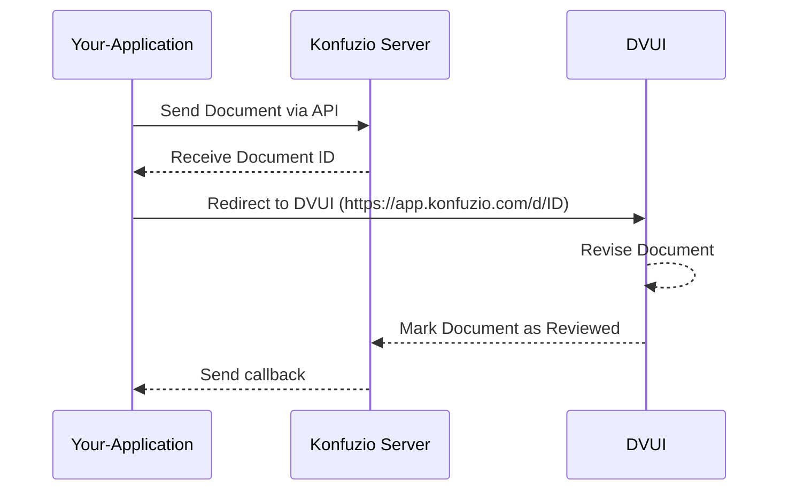

# Integrating the Konfuzio Document Validation UI into Your Application

Welcome to the guide for integrating the Konfuzio Document Validation UI (DVUI) into your application. To
ensure a seamless and efficient integration process, we've outlined the most straightforward and effective method for
incorporating DVUI, alongside alternative options tailored for specific scenarios.

## Prerequisites

- An active account on Konfuzio.
- Access to the Konfuzio Server API.

## Our Recommendation: CDN Integration

For most users and applications, we strongly recommend CDN integration. This method stands out for its simplicity, rapid
deployment, and minimal maintenance, making it the optimal choice for a broad range of projects.

### Why Choose CDN Integration?

- **Ease of Use**: With just a few lines of HTML, your application can harness the full power of DVUI.
- **Quick Setup**: Integration can be completed in minutes, not hours.
- **Low Maintenance**: Updates and improvements are handled by Konfuzio, ensuring you always have access to the latest
  features without any additional effort.

### How to Integrate Using CDN

1. **Include DVUI from Our CDN**

   Add the following tags to your HTML to load DVUI's JavaScript and CSS:

   ```html
   <script defer="defer" src="https://unpkg.com/@konfuzio/document-validation-ui@latest/dist/js/chunk-vendors.js"></script>
   <script defer="defer" src="https://unpkg.com/@konfuzio/document-validation-ui@latest/dist/js/app.js"></script>
   <link href="https://unpkg.com/@konfuzio/document-validation-ui@latest/dist/css/chunk-vendors.css" rel="stylesheet">
   <link href="https://unpkg.com/@konfuzio/document-validation-ui@latest/dist/css/app.css" rel="stylesheet">
   ```

2. **Set Up Access**

   Provide the Document ID and User Token to connect to the Konfuzio Server API:

   ```html
   <div id="app" style="height: 100vh">
     <app document="document_id" user_token="user_token" locale="de/en/es"></app>
   </div>
   ```

3. **Display DVUI**

   Combine the steps above in your HTML. You're now ready to use DVUI in your application.

    ```html
        <script defer="defer" src="https://unpkg.com/@konfuzio/document-validation-ui@latest/dist/js/chunk-vendors.js"></script>
        <script defer="defer" src="https://unpkg.com/@konfuzio/document-validation-ui@latest/dist/js/app.js"></script>
        <link href="https://unpkg.com/@konfuzio/document-validation-ui@latest/dist/css/chunk-vendors.css" rel="stylesheet">
        <link href="https://unpkg.com/@konfuzio/document-validation-ui@latest/dist/css/app.css" rel="stylesheet">
        
        <div id="app" style="height: 100vh">
          <app document="document_id" user_token=”user_token” locale="de/en/es"></app>
        </div>
    ```

### Understanding the Integration Logic Flow

To include a section that outlines the logic flow based on the diagram you provided, we could title the section "
Understanding the Integration Logic Flow". Here's how you might incorporate it into your documentation:

---

## Understanding the Integration Logic Flow

To fully grasp how the Konfuzio Document Validation UI (DVUI) integrates into your application's workflow, it's
important to understand the logic flow involved. The process is outlined in the sequence diagram below, which shows the
interactions between your application, the Konfuzio Server, and the DVUI.

### Step-by-Step Flow:

1. **Your-Application**: This represents your application or codebase initiating the process.
2. **Send Document via API**: Your application sends the document to the Konfuzio Server via its API.
3. **Receive Document ID**: The Konfuzio Server processes the document and returns a unique Document ID.
4. **Redirect to DVUI**: Your application redirects to the DVUI interface (`https://app.konfuzio.com/d/ID`) with the
   received Document ID.
5. **Revise Document**: The user can then review and edit the document within DVUI.
6. **Mark Document as Reviewed**: Once the review process is complete, the document is marked as reviewed in DVUI.
7. **Send Callback**: DVUI sends a callback to your application to indicate the review process is complete.
8. **Konfuzio Server / Your-Application**: Your application receives the callback, concluding the integration loop.

### Diagram:

By following this logic flow, you ensure that documents are processed efficiently and that users can interact with the
DVUI for a seamless document validation experience.



---

Please replace the placeholder for the diagram image with the actual path to where it should be stored or embedded in
your documentation. If the diagram is meant to be inserted directly into this text, then include it at the indicated
position.

## Alternative Integration Methods

While CDN integration is suitable for most, certain scenarios might call for alternative methods. Below, we outline
other options and their specific use cases.

### NPM Package Integration

- **Ideal for**: Projects already using Vue.js or those requiring deeper integration within a web application.
- **Advantages**: Greater control over the integration and customization.
- **Considerations**: Requires familiarity with Vue.js and npm, alongside potential for more complex updates and
  maintenance.

You can read more about this
method [here](https://dev.konfuzio.com/dvui/explanations.html#install-as-an-npm-package)

### Direct Source Code Integration

- **Ideal for**: Applications needing the utmost control over DVUI, including custom functionalities not supported via
  CDN or NPM.
- **Advantages**: Complete control over the codebase.
- **Considerations**: Significantly higher setup and maintenance effort. Recommended only for teams with specific needs
  and the capacity to manage the integration long-term.

You can read more about this
method [here](https://dev.konfuzio.com/dvui/explanations.html#integrate-by-deploying-the-application)

### Iframe Integration

- **Ideal for**: Simple embedding of DVUI into websites without direct interaction with the application's backend or for
  rapidly prototyping.
- **Advantages**: Easy to implement.
- **Considerations**: Limited customization options and potential security concerns. Best for read-only document viewing
  or when other integration methods are not feasible.

You can read more about this method [here](https://dev.konfuzio.com/dvui/explanations.html#iframe-integration)

## Security and Maintenance

Regardless of the chosen integration method, consider the following to ensure a secure and maintainable implementation:

- **Security**: Always secure user tokens and API access. For iframe integrations, ensure your content security policy (
  CSP) is appropriately configured.
- **Maintenance**: While CDN and NPM methods benefit from automatic updates, direct source code integration will require
  manual updates to stay current with DVUI enhancements.

By following these guidelines and focusing on the recommended CDN integration, you'll achieve a seamless integration of
the Konfuzio DVUI into your application, ensuring a robust and user-friendly document validation experience.
